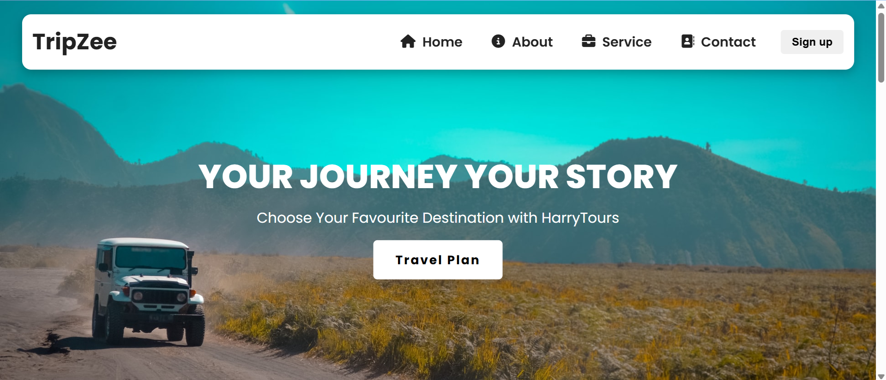

# ✈️ Travel Website

A responsive travel website built with **React**, featuring destination 
browsing and a modern UI. Deployed on Cloudflare Pages.

## 🔗 Live Demo
[View Live →](https://travel-website-byharry.harisshahnawaz97.workers.dev/)

## 📸 Screenshot


## 🛠️ Built With
- React
- CSS3
- Vite
- Deployed on Cloudflare Pages

## 🚀 Getting Started

### Installation
```bash
git clone https://github.com/HarisShahnawaz/TravelWebsite
cd TravelWebsite
npm install
npm run dev
```

## ✨ Features
- Responsive design for all screen sizes
- Destination browsing section
- Modern clean UI
- Mobile-friendly navigation

## 📬 Contact
**Haris Shahnawaz** — [LinkedIn](https://www.linkedin.com/in/haris-shahnawaz-670aa8291/) | [Email](mailto:harisshahnawaz97@gmail.com)
